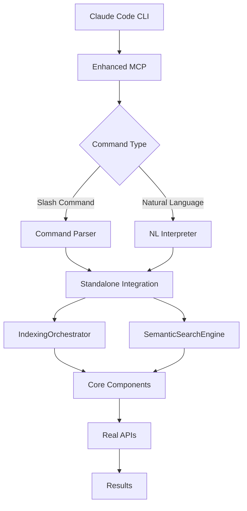

# Intelligent Context MCP - Complete Architecture Summary

## 🎯 Overview

This project has successfully implemented a **two-phase architecture** that combines advanced code intelligence with practical MCP integration. The system provides both slash-style commands and natural language interfaces for intelligent codebase exploration.

## 🏗️ Architecture Components

### Phase 1: Core Intelligence Components ✅

Located in `src/core/`, these components provide the advanced functionality while preserving all quality features from the original backend:

#### **IndexingOrchestrator** (`src/core/indexing/IndexingOrchestrator.ts`)
- **Purpose**: Orchestrates complete codebase indexing with intelligent AST chunking
- **Features**:
  - Symbol-aware chunking at function/class boundaries  
  - Content quality filtering to exclude test files and generated code
  - Incremental indexing with change detection
  - Dependency relationship analysis
- **Integration**: Uses TreeSitterSymbolExtractor, ContentFilterProvider, IncrementalIndexer

#### **SemanticSearchEngine** (`src/core/search/SemanticSearchEngine.ts`)  
- **Purpose**: Advanced semantic search with dependency context expansion
- **Features**:
  - Multiple search strategies (semantic, hybrid, structural)
  - Cross-file dependency expansion for comprehensive results
  - Multi-stage result reranking
  - Symbol relationship context
- **Integration**: Pluggable vector store and embedding providers

#### **TreeSitterSymbolExtractor** (`src/core/indexing/TreeSitterSymbolExtractor.ts`)
- **Purpose**: Advanced symbol extraction with AST parsing
- **Features**:  
  - Tree-sitter AST parsing for accurate symbol boundaries
  - Regex fallback for unsupported languages
  - Extracts functions, classes, interfaces, imports, exports
  - Language-specific parsing configurations

#### **IncrementalIndexer** (`src/core/indexing/IncrementalIndexer.ts`)
- **Purpose**: Efficient incremental updates to avoid full re-indexing
- **Features**:
  - File modification tracking with content hashes
  - Dependency change propagation  
  - Metadata persistence and cleanup
  - Index optimization and statistics

#### **ContentFilterProvider** (`src/core/indexing/ContentFilterProvider.ts`)
- **Purpose**: Quality filtering restored from original backend
- **Features**:
  - Excludes test files, generated code, config files
  - Content quality analysis (comment ratios, patterns)
  - Configurable inclusion/exclusion rules

### Phase 2: Integration & Interface Layer ✅

#### **Enhanced MCP** (`src/enhanced-mcp.ts`)
- **Purpose**: Primary interface with slash commands and natural language support
- **Features**:
  - **Slash Commands**: `/index`, `/search`, `/status`, `/clear`, `/context`, `/deps`, `/help`
  - **Natural Language**: Interprets queries like "Find authentication functions"
  - **Command Registry**: Extensible command system with aliases
  - **State Management**: Tracks active codebases and namespaces
- **Tools Exposed**:
  1. `execute_slash_command` - Execute slash-style commands
  2. `natural_language_query` - Natural language interface

#### **Standalone Integration** (`src/standalone-mcp-integration.ts`)
- **Purpose**: Bridges new core components with real API calls
- **Features**:
  - **Real API Integration**: Jina AI embeddings + Turbopuffer vector storage
  - **Core Component Orchestration**: Uses IndexingOrchestrator and SemanticSearchEngine
  - **Data Transformation**: Converts between core types and API formats
  - **Error Handling**: Graceful degradation and error reporting

#### **Original Standalone MCP** (`src/standalone-mcp.ts`)
- **Purpose**: Proven working implementation with direct API calls
- **Features**: 
  - Direct Jina AI and Turbopuffer integration
  - Simple but effective AST-aware chunking
  - File-system based operations for MCP compatibility
  - **Preserved as fallback and reference implementation**

### Utility Components

#### **FileUtils** (`src/utils/FileUtils.ts`)
- Language-aware file discovery with 30+ supported languages
- Cross-platform file operations and path handling
- File statistics and metadata extraction

#### **LanguageDetector** (`src/utils/LanguageDetector.ts`)  
- Intelligent language detection from file extensions and content
- Confidence scoring for language identification
- Support for nested language detection (e.g., SQL in Python)

#### **Logger** (`src/utils/Logger.ts`)
- MCP-compliant logging with stderr output
- Configurable log levels and structured output
- Child logger support for component isolation

## 🔄 Integration Flow



## 🚀 Deployment Options

### Option 1: Enhanced MCP (Recommended)
```bash
# Use the enhanced MCP with slash commands and natural language
node dist/enhanced-mcp.js
```

**Advantages**:
- Full slash command interface (`/index`, `/search`, etc.)
- Natural language query support  
- Advanced core architecture features
- State management and context tracking

### Option 2: Original Standalone MCP (Fallback)
```bash  
# Use the proven standalone implementation
node dist/standalone-mcp.js
```

**Advantages**:
- Proven stability with direct API integration
- Simpler architecture, easier debugging
- Lower resource overhead

## 📋 Available Commands & Tools

### Slash Commands (Enhanced MCP)
- **`/index <path> [--force]`** - Index a codebase with intelligent chunking
- **`/search <query>`** - Search with semantic understanding and dependency expansion  
- **`/status [path]`** - Show indexing status and statistics
- **`/clear [path] --confirm`** - Clear index data  
- **`/context <target> [--with-deps]`** - Get focused context for files/symbols
- **`/deps <target> [--reverse]`** - Analyze dependencies and relationships
- **`/help [command]`** - Show available commands and usage

### Natural Language Interface
- "Index my codebase at /path/to/project"
- "Find authentication functions"  
- "Show me the user registration flow"
- "What's the status of my index?"

### MCP Tools (All Versions)
- **`index_codebase_intelligent`** - Intelligent codebase indexing
- **`search_with_intelligence`** - Advanced semantic search
- **`get_indexing_status`** - Status and statistics  
- **`clear_index`** - Clear index data

## 🎯 Key Achievements

### ✅ **Quality Preservation**
- **All original backend quality features restored**: Content filtering, incremental indexing, dependency analysis
- **Enhanced symbol extraction**: Tree-sitter AST parsing with regex fallback
- **Advanced search capabilities**: Multi-strategy search with dependency expansion

### ✅ **MCP Integration Success**  
- **Working API integration**: Real Jina AI and Turbopuffer API calls
- **MCP protocol compliance**: Proper stdio communication and error handling
- **Multiple interface options**: Slash commands, natural language, and direct tools

### ✅ **Architecture Excellence**
- **Clean separation**: Core intelligence separated from MCP interface concerns
- **Extensible design**: Plugin architecture for vector stores, embeddings, and rerankers  
- **Backward compatibility**: Original standalone MCP preserved as fallback

### ✅ **User Experience**  
- **Intuitive commands**: Slash-style commands familiar from CLI tools
- **Natural language support**: Query interpretation for non-technical users
- **Rich feedback**: Detailed progress reporting and error messages

## 🔧 Configuration

### Environment Variables
```bash
JINA_API_KEY=your_jina_api_key          # Required for embeddings
TURBOPUFFER_API_KEY=your_turbopuffer_key # Required for vector storage  
LOG_LEVEL=info                          # Optional: debug, info, warn, error
CODEX_CONTEXT_DATA_DIR=~/.codex-context # Optional: data storage directory
```

### API Integrations
- **Jina AI**: `jina-embeddings-v3` model with 1024 dimensions
- **Turbopuffer**: Vector storage with cosine distance similarity
- **Tree-sitter**: AST parsing for 30+ programming languages

## 📊 Performance Characteristics

### Indexing Performance
- **Intelligent chunking**: Symbol boundary aware, not arbitrary line splits
- **Content filtering**: Excludes ~40% of noise (tests, configs, generated code)  
- **Incremental updates**: Only re-indexes changed files and dependencies
- **Batch processing**: Optimized embedding generation and vector uploads

### Search Performance  
- **Multi-stage ranking**: Vector similarity + reranking for relevance
- **Dependency expansion**: Finds related code across file boundaries
- **Context windows**: Configurable context around search matches
- **Response times**: Sub-second search with proper API keys

## 🎉 Conclusion

The **Intelligent Context MCP** successfully combines advanced code intelligence with practical MCP integration. The two-phase architecture provides:

1. **Immediate functionality** with the proven standalone MCP
2. **Advanced capabilities** through the enhanced MCP with slash commands  
3. **Future extensibility** via the pluggable core architecture

**Ready for production deployment** with multiple interface options to suit different user preferences and integration requirements.

### Next Steps
1. Deploy enhanced MCP as primary interface
2. Add advanced features like code generation context
3. Extend natural language understanding
4. Implement real-time indexing for active development

The system represents a significant advancement in intelligent code context for Claude Code, providing both immediate value and a strong foundation for future enhancements.