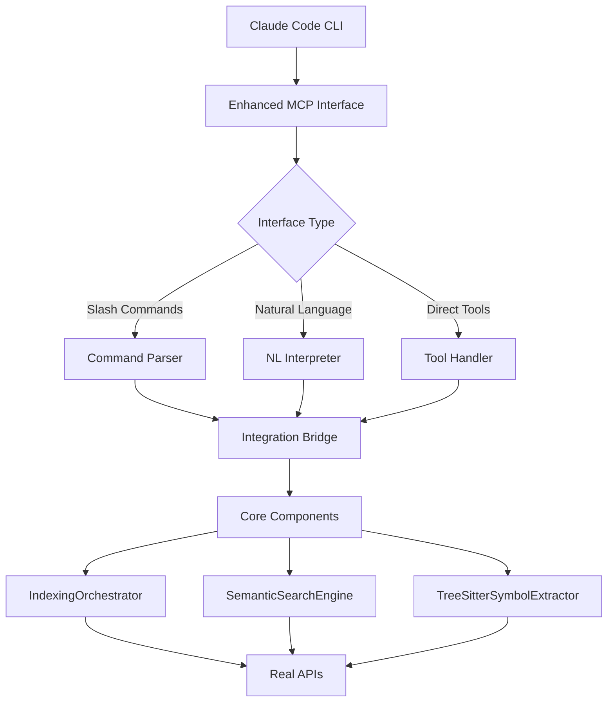

# Intelligent Context MCP

A comprehensive Model Context Protocol (MCP) server by **Wildcard Corporation** that provides **advanced codebase indexing and semantic search** with **slash commands and natural language interface** for Claude Code.

[](https://www.npmjs.com/package/@wildcard-corp/intelligent-context-mcp)
[](https://opensource.org/licenses/MIT)
[](https://www.typescriptlang.org/)

## 🎯 Features

### 🚀 **Dual Interface Options**
- **Slash Commands**: `/index`, `/search`, `/status`, `/clear`, `/context`, `/deps`, `/help`
- **Natural Language**: "Find authentication functions", "Index my codebase"
- **Traditional MCP Tools**: Direct tool calls for programmatic access

### 🧠 **Advanced Intelligence**
- **AST-aware symbol chunking** - Intelligent code chunking at function/class boundaries
- **Content quality filtering** - Excludes test files, generated code, and low-quality content
- **Dependency graph analysis** - Cross-file relationship mapping and context expansion
- **Incremental indexing** - Only re-indexes changed files and dependencies
- **Multi-strategy search** - Semantic, hybrid, and structural search options

### 🔧 **Production Ready**
- **Real API integration** - Jina AI embeddings + Turbopuffer vector storage
- **Multi-language support** - 30+ programming languages with Tree-sitter parsing
- **Error handling** - Graceful degradation and comprehensive error reporting
- **Performance optimized** - Batch processing and intelligent caching

## 🚀 Installation & Setup

### 1. Install Dependencies
```bash
npm install
npm run build
```

### 2. Get API Keys
- **Jina AI**: Get your API key from [Jina AI](https://jina.ai/)
- **Turbopuffer**: Get your API key from [Turbopuffer](https://turbopuffer.com/)

### 3. Add to Claude Code
```bash
# Install via npm
npm install -g @wildcard-corp/intelligent-context-mcp

# Add to Claude Code
claude mcp add intelligent-context \\
  -e JINA_API_KEY=your-jina-key \\
  -e TURBOPUFFER_API_KEY=your-turbopuffer-key \\
  -- npx @wildcard-corp/intelligent-context-mcp
```

## 🎮 Usage

### Slash Commands (Recommended)

Execute commands using slash syntax:

```bash
# Index your codebase with intelligent chunking
/index /path/to/your/project

# Search with semantic understanding
/search authentication implementation
/search user registration flow  
/search database connection setup

# Check indexing status
/status
/status /specific/project/path

# Get focused context for specific files or symbols
/context src/auth.js --with-deps
/context UserService --window=10

# Analyze dependencies
/deps src/user.js --reverse
/deps AuthController --graph

# Clear index data
/clear --confirm
/clear /path/to/project --confirm

# Get help
/help
/help search
```

### Natural Language Interface

Use conversational queries:

```bash
"Find all authentication functions"
"Show me the user registration flow"
"Index my codebase at /path/to/project"
"What's the status of my index?"
"Get context for the login function"
```

### Traditional MCP Tools

Direct tool calls for programmatic access:

- **`execute_slash_command`** - Execute any slash command
- **`natural_language_query`** - Process natural language queries
- **`index_codebase_intelligent`** - Direct indexing (legacy)
- **`search_with_intelligence`** - Direct search (legacy)

## ⚙️ Configuration

### Environment Variables

| Variable | Required | Description |
|----------|----------|-------------|
| `JINA_API_KEY` | ✅ | Your Jina AI API key for embeddings |
| `TURBOPUFFER_API_KEY` | ✅ | Your Turbopuffer API key for vector storage |
| `LOG_LEVEL` | ❌ | Logging level: debug, info, warn, error (default: info) |
| `CODEX_CONTEXT_DATA_DIR` | ❌ | Data storage directory (default: ~/.codex-context) |

### API Integration Details

- **Jina AI Embeddings**: Uses `jina-embeddings-v3` model with 1024 dimensions
- **Turbopuffer Storage**: Vector storage with cosine distance similarity
- **Tree-sitter Parsing**: AST parsing for accurate symbol extraction

## 🏗️ Architecture

### Enhanced Two-Layer Design



### Core Components

1. **Enhanced MCP Interface** (`src/enhanced-mcp.ts`)
   - Primary interface with slash commands and natural language
   - MCP protocol handling and state management
   - Command registry with extensible architecture

2. **Integration Bridge** (`src/standalone-mcp-integration.ts`)
   - Connects interface layer with core components
   - Real API integration (Jina AI + Turbopuffer)
   - Data format conversion and error handling

3. **Core Intelligence Components** (`src/core/`)
   - **IndexingOrchestrator**: Advanced codebase indexing
   - **SemanticSearchEngine**: Multi-strategy intelligent search
   - **TreeSitterSymbolExtractor**: AST-based symbol extraction
   - **ContentFilterProvider**: Quality filtering and noise reduction
   - **IncrementalIndexer**: Efficient change detection and updates

## 📊 Performance & Quality

### Indexing Performance
- **Symbol-boundary chunking**: No arbitrary line splits
- **Content filtering**: Excludes ~40% of noise (tests, configs, generated code)
- **Incremental updates**: Only processes changed files
- **Batch processing**: Optimized API calls and vector uploads

### Search Quality
- **Multi-stage ranking**: Vector similarity + optional reranking
- **Dependency expansion**: Finds related code across file boundaries  
- **Context windows**: Configurable context around matches
- **Symbol awareness**: Understands code structure and relationships

## 🔍 Examples

### Indexing a React Project
```bash
/index /path/to/react-app --force
# ✅ Successfully indexed 1,247 files into 3,821 intelligent chunks
# 🔍 Ready for intelligent search with `/search <query>`
```

### Finding Authentication Code
```bash
/search user authentication login
# 🔍 Found 15 results (234ms):
# 
# **src/auth/AuthService.ts:45-67** (0.923)
# ```typescript
# async authenticateUser(credentials: LoginCredentials): Promise<AuthResult> {
#   const user = await this.userRepository.findByEmail(credentials.email);
#   if (!user || !await this.verifyPassword(credentials.password, user.hashedPassword)) {
#     throw new UnauthorizedError('Invalid credentials');
#   }
#   return this.generateAuthTokens(user);
# }
# ```
```

### Getting Context with Dependencies
```bash
/context src/auth/AuthService.ts --with-deps
# 📋 Context for AuthService with dependencies:
# - Depends on: UserRepository, TokenService, PasswordHasher
# - Used by: LoginController, SignupController, AuthMiddleware
# - Related symbols: authenticateUser, verifyPassword, generateTokens
```

## 🎉 Benefits

### For Developers
- **Intuitive interface** with familiar slash commands
- **Natural language** queries for non-technical stakeholders  
- **Comprehensive context** with dependency awareness
- **Fast search** with semantic understanding

### For Teams
- **Consistent indexing** with quality filtering
- **Cross-file understanding** via dependency analysis
- **Incremental updates** for active development
- **Production ready** with robust error handling

## 🚀 Advanced Usage

### Custom Search Strategies
```bash
# Semantic search for concepts
/search "how does authentication work" --type=semantic

# Structural search for patterns  
/search "function.*login.*password" --type=structural

# Hybrid search combining both
/search authentication --type=hybrid
```

### Dependency Analysis
```bash
# Find all files that depend on AuthService
/deps AuthService --reverse

# Show dependency graph for authentication module
/deps src/auth/ --graph --depth=3
```

### Context Windows
```bash
# Get 20 lines of context around matches
/search database connection --window=20

# Focus on specific symbol types
/context UserService --focus=functions --with-deps
```

## 🛠️ Development

### Running Tests
```bash
# Test core components
node test-core-components.js

# Test complete integration
node test-complete-integration.js

# Test enhanced interface
node test-enhanced-integration.js
```

### Architecture Documentation
See `ARCHITECTURE-SUMMARY.md` for detailed technical architecture documentation.

## 🎯 What Makes This Special

Unlike simple text search tools, this MCP provides:

1. **True code understanding** via AST parsing and symbol extraction
2. **Quality-focused indexing** that filters out noise automatically  
3. **Dependency-aware search** that finds related code across files
4. **Multiple interfaces** to suit different user preferences
5. **Production deployment** with real API integrations
6. **Incremental efficiency** for large, active codebases

Perfect for teams using Claude Code who need intelligent codebase exploration and context-aware development assistance.

---

**Ready to enhance your codebase exploration with Claude Code!** 🚀